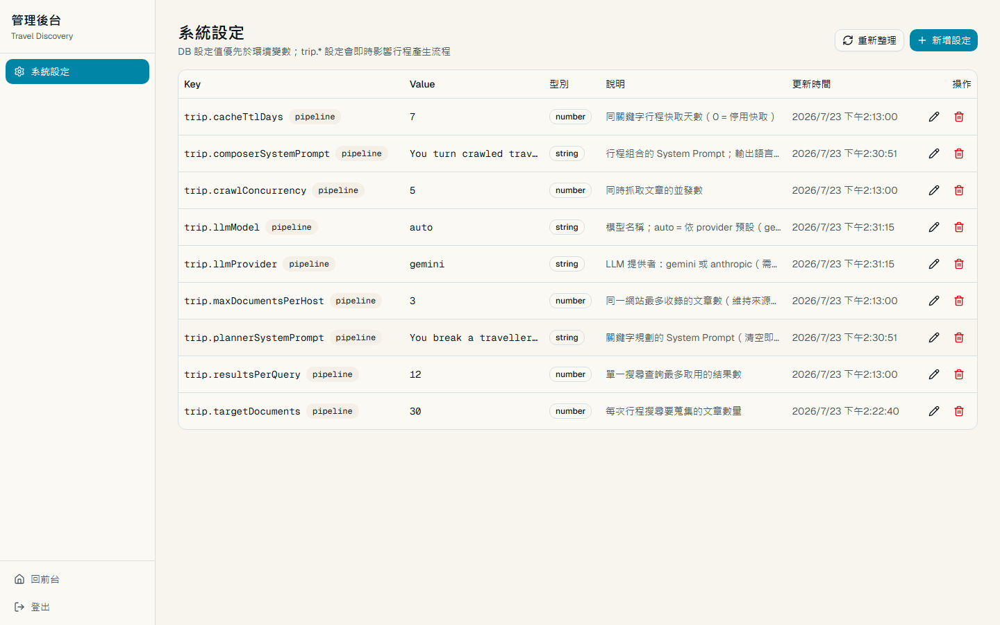
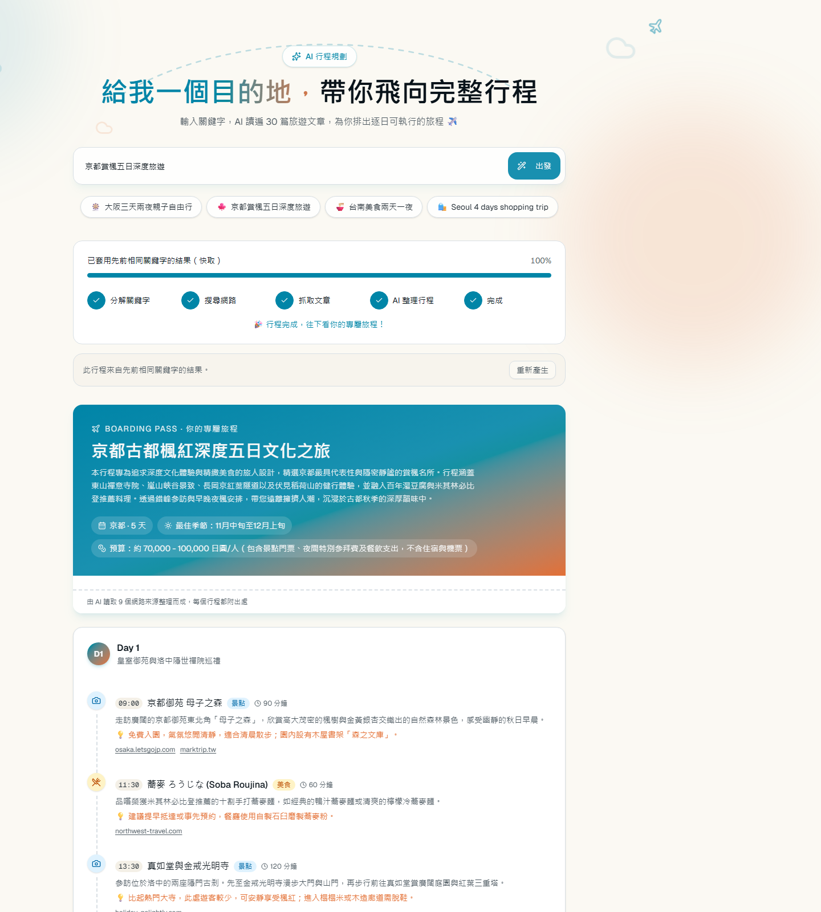

# open-go

AI-powered travel planning platform. Enter a keyword and it builds multilingual search
queries, crawls ~30 travel articles, and uses LLMs (Gemini/Claude) to compose a grounded
day-by-day itinerary with cited sources — plus a runtime-configurable admin console.

## Screenshots

| Trip planner | Admin console |
| --- | --- |
|  |  |

AI-composed itinerary for「京都賞楓五日深度旅遊」— boarding-pass summary plus a
day-by-day plan where every item cites its source articles:



Regenerate anytime with Playwright (reuses the backend's dependency, no extra install):

```bash
# both apps must be running first
pnpm screenshots
# env: SCREENSHOT_BASE_URL (default http://localhost:35173), ADMIN_PASSWORD,
#      SCREENSHOT_TRIP_KEYWORD (default 京都賞楓五日深度旅遊; served from cache
#      when a recent job exists, otherwise runs the full pipeline)
```

## Stack

- Backend: Node.js + NestJS + Prisma + PostgreSQL
- Frontend: Next.js (App Router) + Tailwind CSS + shadcn/ui
- Workspace: pnpm

## Quick start

1. Install dependencies

```bash
pnpm install
```

2. Configure database

```bash
copy backend/.env.example backend/.env
```

3. Run migration and seed

```bash
pnpm --filter backend prisma:migrate
pnpm --filter backend seed
```

4. (Optional) Validate non-duplicate ingestion flow

```bash
pnpm --filter backend ingest:demo
```

Expected output should include:

- `first: "created"`
- `second: "skipped"`
- `third: "updated"`

5. Start apps

```bash
pnpm dev:backend:auto
pnpm dev:frontend
```

## API

- `GET /regions/search?q=台北`
- `GET /regions/search?q=<keyword>` logs each non-empty keyword into `SearchKeywordLog`
- `GET /regions/:id/pois`
- `GET /regions/:id/recommendations`
- `GET /regions/:id/categories`
- `POST /ingestion/cache-check`
- `POST /ingestion/pois`
- `POST /automation/discover-region` (manual region discovery trigger)
- `POST /trips` → `{ jobId }` (start a keyword-driven itinerary job)
- `GET /trips/:id` (job status, queries and itinerary)
- `GET /trips/:id/stream` (Server-Sent Events progress feed)
- `GET /trips/:id/documents` (crawled source documents)
- `POST /affiliate/events` (public CTA funnel ingest: impression / click / redirect)
- `GET/POST /settings`, `GET/PATCH/DELETE /settings/:key` (admin-only, `x-admin-key` header)

## AI trip planning

`POST /trips` runs an asynchronous pipeline for a single keyword:

1. **planning** — the LLM splits the keyword into 6–10 search queries across attraction /
   food / transport / accommodation / itinerary intents, in mixed languages.
2. **searching** — each query is run against a web search engine; results are de-duplicated
   and capped per host until the target document count (default 30) is collected.
3. **crawling** — the pages are fetched concurrently, boilerplate is stripped, and body
   text is stored in `TripDocument`.
4. **composing** — the LLM reads the crawled corpus and returns a structured day-by-day
   itinerary, where every item cites the source URLs it came from.

Progress is pushed over SSE, so the frontend shows each stage live.

### Booking & ticket deep links

Finished itineraries surface outbound CTAs (visually separate from cited sources):

- **Lodging** — each day's overnight stay area links to Booking.com, Agoda, and Google
  Hotels. When the stay has coordinates, Booking / Agoda searches use a ~3 km radius
  around that pin; otherwise the query is destination + cleaned area text.
- **Tickets** — `attraction` stops (and located `other` sights) offer Klook / KKday
  searches for the attraction name, plus a destination-level hot-ticket fallback.
- **Tracking** — each CTA records `cta_impression`, `cta_click`, and
  `outbound_redirect` to the `AffiliateEvent` table (`POST /affiliate/events`) and
  mirrors the same payload to Vercel Analytics. Fields: `jobId`, `day`, `category`
  (`lodging` | `ticket`), `partner`. The admin console at `/admin/affiliate` shows
  CTR by partner/category, a daily trend, and a recent event log
  (`GET /ops/analytics/affiliate`).

Both LLM steps go through one `StructuredLlm` interface (`src/trip/llm/`): a zod schema
defines the expected shape, and each adapter enforces it its own way — Gemini via
`responseJsonSchema` plus a `safeParse` on the reply, Claude via the SDK's
structured-output helper. An `LlmRouterService` resolves the provider and model **on every
call** from the runtime settings (below), so the LLM can be switched from the admin console
without a restart; changes are logged as `Trip LLM: provider=… model=…`.

## Admin console & runtime settings

`/admin` is a password-protected console, separate from the user-facing pages, backed by a
DB `Setting` table with full CRUD. Values in the DB take precedence over environment
variables and apply to the **next job without a restart** (reads go through a 30s cache
that is invalidated on every write). The settings page also has dedicated cards for
**Pipeline tuning** (search / crawl / cache / queue concurrency) and **LLM model**
selection so the common `trip.*` knobs are not buried only in the key/value table.

Auth is deliberately lightweight: `ADMIN_PASSWORD` is checked by a login form which sets an
httpOnly cookie (a salted SHA-256 digest — the plaintext never reaches the browser);
`frontend/proxy.ts` gates `/admin/*` and `/api/admin/*`. Browser calls go through Next.js
server routes that forward to the backend with an `x-admin-key` header, so the shared
secret also never leaves the server. The backend guards `/settings` with the same header
and fails closed when `ADMIN_PASSWORD` is unset.

Job debugging lives at `/admin/jobs/[id]`: traveller preferences (when set), a link that
opens the public `/trip/[jobId]` page, the job-level failure message, and per-document
crawl errors (stored on `TripDocument.error` for crawls run after that column was added;
older failed rows show status only).

Seeded settings:

| Key | Default | Purpose |
| --- | --- | --- |
| `trip.targetDocuments` | `30` | Articles to collect and crawl per job. |
| `trip.crawlConcurrency` | `5` | Parallel page fetches. |
| `trip.cacheTtlDays` | `7` | Days a finished job satisfies the same keyword again (`0` disables). |
| `trip.resultsPerQuery` | `12` | Max results taken from a single search query. |
| `trip.maxDocumentsPerHost` | `3` | Max documents from one host, to keep sources diverse. |
| `trip.maxConcurrentJobs` | `3` | Whole pipelines allowed to run at once. |
| `trip.llmProvider` | `gemini` | `gemini` or `anthropic`; the router falls back to env on bad values. |
| `trip.llmModel` | `auto` | `auto` = the provider's default model; or any explicit model name. |
| `trip.plannerSystemPrompt` | built-in | System prompt for the keyword planner (blank = code default). |
| `trip.composerSystemPrompt` | built-in | System prompt for the itinerary composer (blank = code default). |

### Search source

Google no longer renders results for plain HTTP clients — `google.com/search` returns a
JavaScript-only shell that redirects non-JS clients to `/httpservice/retry/enablejs`, so
`fetch` + an HTML parser can never see a result. Search is therefore driven by a headless
Chromium (Playwright) that executes the page and reads the rendered links; only this step
uses a browser, article bodies are still fetched with plain HTTP.

Two launch details are load-bearing — changing either makes Google serve its "unusual
traffic" bot check instead of results:

- `channel: 'chromium'` — the full new-headless Chromium, not Playwright's default headless
  shell, whose fingerprint Google rejects.
- `--disable-blink-features=AutomationControlled` plus the `navigator.webdriver` patch in
  `GoogleSearchProvider`.

If Google still blocks (or `TRIP_SEARCH_BROWSER=false`), the pipeline falls back to
`lite.duckduckgo.com`, which returns server-rendered HTML, and says so in the job's
progress message.

The backend image installs Chromium via `npx playwright install --with-deps chromium`, which
is why it is Debian-based rather than Alpine — Playwright's Chromium build is glibc-only.

### Environment variables (backend)

Env values act as the fallback when no DB setting exists.

| Variable | Default | Purpose |
| --- | --- | --- |
| `ADMIN_PASSWORD` | — | Enables the admin console and `/settings` API (unset = everything admin is blocked). |
| `TRIP_LLM_PROVIDER` | `gemini` | Fallback provider when the `trip.llmProvider` setting is absent. |
| `TRIP_MODEL` | per provider | Fallback model. Defaults: `gemini-flash-latest` / `claude-opus-4-8`. |
| `GEMINI_API_KEY` | — | Required when the provider is `gemini` (`GOOGLE_API_KEY` also accepted). |
| `ANTHROPIC_API_KEY` | — | Required when the provider is `anthropic`. |
| `TRIP_TARGET_DOCUMENTS` | `30` | Fallback for `trip.targetDocuments`; also seeds its initial value. |
| `TRIP_CRAWL_CONCURRENCY` | `5` | Fallback for `trip.crawlConcurrency`. |
| `TRIP_SEARCH_BROWSER` | `true` | Set `false` to skip Chromium and use the fallback engine only. |
| `TRIP_BROWSER_HEADLESS` | `true` | Set `false` to watch the search browser while debugging. |

Frontend (server-side): `ADMIN_PASSWORD` (same value as the backend) and
`BACKEND_INTERNAL_URL` (backend origin reachable from the frontend server — in docker
`http://backend:3000`).

Example:

```bash
curl -X POST http://localhost:33000/trips \
  -H "Content-Type: application/json" \
  -d "{\"keyword\":\"大阪三天兩夜自由行\"}"

curl -N http://localhost:33000/trips/<jobId>/stream
```

## Background automation

Backend includes two scheduled jobs:

1. **Attraction discovery sync** (every 30 minutes)
   - Pulls category-based candidates from Wikipedia by region query.
   - Writes new POIs to DB and updates existing ones through the ingestion pipeline.
   - Categories include `attraction`, `food`, `shopping`, `cafe`, and `hotel` for frontend filtering.
2. **External review-link sync** (every 45 minutes)
   - Generates outbound review links for each POI (Google Maps, TripAdvisor, Booking).
   - Stores links only; review text is not scraped or persisted.

Manual trigger example:

```bash
curl -X POST http://localhost:33000/automation/discover-region \
  -H "Content-Type: application/json" \
  -d "{\"query\":\"Japan Osaka\"}"
```

## Docker

Backend container startup is migration-aware by default:

- Runs `prisma migrate deploy` before starting NestJS.
- Migration history is automatically tracked in Prisma's `_prisma_migrations` table.

The backend image is Debian-based (not Alpine) and installs Chromium, because the trip
pipeline reads Google's JS-rendered results through Playwright. It also sets
`shm_size: 1gb`, without which Chromium crashes on the container default of 64MB.

Build images:

```bash
pnpm docker:build
```

Build + start + print endpoints:

```powershell
powershell -ExecutionPolicy Bypass -File .\infra\build-images.ps1
```

Run all services (postgres + backend + frontend):

```bash
pnpm docker:up
```

Stop:

```bash
pnpm docker:down
```

Host ports:

- Frontend: `35173`
- Backend API: `33000`
- Postgres: `35432`

Set `ADMIN_PASSWORD` in `infra/.env` before `docker:up` to enable the admin console at
`http://localhost:35173/admin`.
